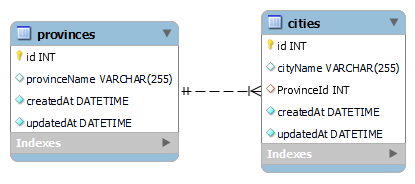

# fwd10_prov_city
## Assignment of CRUD API for provinces and cities of Indonesia


In this project, we are learning and creating a project about **CRUD** (create, read, update and delete) process.
Also we are going to make API end point that is related to the CRUD process.

## Important Note (to our dear mentor Arya Kusuma)
You can find 2 files in this repository: app.js and **app-tugas.js**. The one that is required for assignment submission is **app-tugas.js** 👍.
While app.js is the one we are using to explore the features of SequelizeJS

## Revision / Version
As we are making progress in learning things, the project is also growing into more complex features.
Below is some note, regarding the project revision / version.

| Rev./Ver. | Description |
| --- | --- |
| 1.0 | make **Create** and **Read API** for provinces and cities |
| 1.1 | add **Update** and **Delete API** for provinces and cities |
| 1.2 | add API for **province's detail** (includes all the cities that **belongs to the province**) |
| 1.3 | add validation process that check whether the city / province to be inserted are already exists |

## API Endpoints
Here are the list of API endpoint:

| API | Objective |
| --- | --- |
| `app.get(/province)` | get all provinces' name |
| `app.get(/province/:id)` | get a province's detail by its ID |
| `app.post(/province)` | create/add one or more province(s) |
| `app.put(/province/:id)` | update a province's detail |
| `app.delete(province/:id)` | delete a province |
| `app.get(/province/:id/city)` | get all the cities that belongs to a specific province |
| `app.get(/city)` | get all cities' name |
| `app.get(/city/:id)` | get a city's detail by its ID |
| `app.post(/city)` | create/add one or more city(s) |
| `app.put(/city/:id)` | update a city's detail |
| `app.delete(city/:id)` | delete a city |

## API Simulation
We are using Postman to simulate the API end point. You can find the Postman JSON file in this repository, called:
`fwd10_prov_city.postman_collection.json`

## Entity Relational Diagram 
Below is the diagram of the table that we need to create:



## Associations
We are also trying to explore about association between tables. As depicted in the ERD above, we have a **one to many** relation between province and city table.
One province can have many cities, but one city belong to one province.

This is done in models' files with these syntaxes:
```
Provinces.hasMany(models.Cities);
Cities.belongsTo(models.Provinces);
```
Also in migration's file, we need to add a foreign key definition
```
ProvinceId: {
  type: Sequelize.INTEGER,
    references: {
    model: "Provinces",
    key: "id",
    as: "ProvinceId",
  }
```
Finally when doing query we need to include that foreign key in the query
```
Cities.findAll({
  attributes: ["id", "cityName"],
  include: {
    model: Provinces,
    attributes: ["id", "provinceName"],
}
```
The syntax above will create the following query sent to MySQL database
```
Executing (default): SELECT `Cities`.`id`, `Cities`.`cityName`, `Province`.`id` AS `Province.id`, 
`Province`.`provinceName` AS `Province.provinceName` FROM `Cities` AS `Cities` 
LEFT OUTER JOIN `Provinces` AS `Province` ON `Cities`.`ProvinceId` = `Province`.`id`;
```

## Validation
In this project the validation process is perfomed to check whether the city / province to be inserted, are already exists or not. From [documentation](https://sequelize.org/docs/v7/core-concepts/validations-and-constraints/), there is: **Validations & Constraints**. Validations are checks performed in the Sequelize level, the code that we put in our JavaScript file. On the other hand, constraints are rules defined at SQL level. 

Example of constraint in our project for provinceName: 
```
/* ... */ {
  provinceName: {
    type: Sequelize.STRING,
    allowNull: false,
    unique: true
  },
  } /* ... */
```
This makes **provinceName** unique and no other objects can have same value. However, we have not tried this constraint in **Version 1.3**. Instead we are using validation, which in a nutshell works by comparing the (new) input **provinceName** with existing data in MySQL database.
```
Provinces.findOne({ where: { provinceName: req.body.provinceName } })
```
So basically we make a query, to find a row/data whose provinceName value equals provinceName from the input request body.

## Bulk creation - the rise of async function
For Create process, we want to accomodate bulk creation of data. In the Postman, this is done by feeding multiple (array of) object, instead of just one.
```
[
	{"provinceName": "DKI Jakarta"},
	{"provinceName": "Jawa Barat"},
	{"provinceName": "Jawa Tengah"},
	{"provinceName": "Jawa Timur"},
	{"provinceName": "DI Yogyakarta"},
	{"provinceName": "Banten"}
]
```
So far, we have tried 2 solutions: models **bulkCreate** and for loop (iteration).
The first solution is easily done by using following syntax:
```
Provinces.bulkCreate(req.body)
```
However, when using this solution -- we have not found any way of validation to check whether the city / province to be inserted, are already exists or not.
Hence we move to the other solution, which is for loop (iteration). Basically we are doing iteration as much as the number of input objects from Postman. In each iteration the followings are done:
1. Check if data already exists 
```
Provinces.findOne({ where: { provinceName: req.body.provinceName } })
```
2. Create (insert) data
```
Provinces.create(req.body)
```
3. Print the result either data is inserted or not
```
res.send(`Province ${req.body.provinceName} is inserted into database.`);
res.send(`Province ${req.body.provinceName} is already existed`);
```

However applying this solution, requires the application of **async function**. So basically, during the iteration you can do each stuffs mentioned above without having to wait for one process to finish before starting another process (synchronize function).
```
app.post("/province", async function (req, res) {
  await Provinces.findOne({ where: { provinceName: req.body.provinceName } })
    .then(async function (result) {
      if (result === null) {
        await Provinces.create(req.body)
         .then((result) => {
           res.send(`Province ${req.body.provinceName} is inserted into database.`);
         })
         .catch((err) => {
           res.send(err);
         });
      } else res.send(`Province ${req.body.provinceName} is already existed`);
    }
});
```

***

That's it! Feel free to [contact me](mailto:taufan2922@gmail.com?subject=[GitHub]%20fwd10_province_city) if you have any questions regarding this repo 😉


